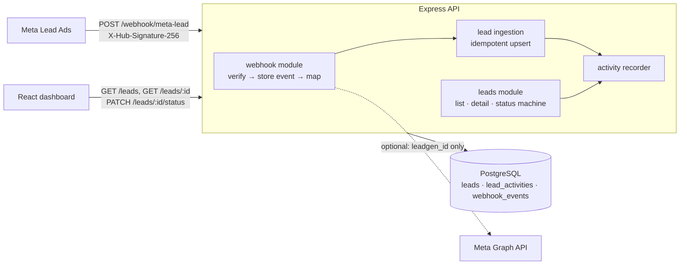

# Lead Intake Service

Receives leads from **Meta Lead Ads webhooks**, stores them in PostgreSQL with an **append-only audit trail**, and shows them in a React dashboard: lead list, lead detail, status changes and an activity timeline.

| | |
|---|---|
| **Live app** | _TODO: add Vercel URL_ |
| **Live API** | _TODO: add Render URL_ (`/health`) |
| **Stack** | Node 22 · Express 5 · TypeScript · Prisma · PostgreSQL 16 · React 19 · TanStack Query · Vite · Docker |

> The API runs on Render's free tier, which sleeps after 15 minutes of inactivity. The first request after that takes about 30–50 s while the instance wakes up.

---

## Contents

1. [Architecture](#architecture)
2. [Data model and audit design](#data-model-and-audit-design)
3. [API](#api)
4. [Running locally](#running-locally)
5. [Testing](#testing)
6. [Deployment](#deployment)
7. [Trade-offs](#trade-offs)
8. [Scaling considerations](#scaling-considerations)
9. [Future improvements](#future-improvements)

---

## Architecture



### Request flow: incoming lead

1. **Verify.** The webhook route reads the **raw body**, because the signature is computed over exact bytes, and checks `X-Hub-Signature-256` (HMAC-SHA256 with the app secret) using a constant-time compare. Unsigned requests get `401` and never touch the database.
2. **Record the delivery.** The payload is stored in `webhook_events` (`RECEIVED`) so every delivery can be inspected or replayed.
3. **Map.** Each `leadgen` change is mapped into a provider-agnostic `NormalizedLead`: name, email and phone are normalised, and unknown form answers are kept as `customFields`. Real Meta webhooks only carry `leadgen_id`. If `META_PAGE_ACCESS_TOKEN` is set, the details are fetched from the Graph API. Otherwise the `field_data` in the payload is used, which lets the service be demoed without a Meta app.
4. **Ingest idempotently**, keyed on `(source, external_id)`, all inside **one transaction**:
   - new lead → insert + `LEAD_CREATED`
   - known lead with changed data → update + `LEAD_UPDATED` with a field-level diff
   - exact redelivery → no write and no activity (Meta retries aggressively)
5. **Answer.** `200` → event `PROCESSED`. A schema error → `400` and `FAILED`, because the payload will never succeed, so a retry is pointless. Any other error → `5xx` and `FAILED`, so Meta retries later.

### Code layout

```
backend/
  prisma/schema.prisma            data model + migrations
  src/
    app.ts / server.ts            composition, graceful shutdown
    config/env.ts                 zod-validated env, fail fast on misconfig
    middleware/error-handler.ts   one error shape for every failure
    modules/
      webhook/                    Meta-specific: signature, schema, mapper, Graph client, route
      leads/                      provider-agnostic: ingestion, diff, status machine, queries, routes
      activities/                 the single place audit rows are written
    scripts/seed.ts               demo data through the real services
  tests/unit, tests/integration
frontend/
  src/api/                        typed fetch client + TanStack Query hooks
  src/pages/                      LeadListPage, LeadDetailPage
  src/components/                 ActivityTimeline, StatusChanger, StatusBadge, …
```

`webhook/` knows about Meta; `leads/` does not. A Google Ads or LinkedIn integration would be a new adapter that produces a `NormalizedLead`. Ingestion, audit and the UI stay unchanged.

---

## Data model and audit design

| Table | Purpose | Key points |
|---|---|---|
| `leads` | Current state of each lead | `UNIQUE (source, external_id)` is the idempotency key. `version` is incremented on every write for optimistic locking. Unknown form answers are stored in `custom_fields jsonb`. |
| `lead_activities` | **Append-only** audit log | `type` (`LEAD_CREATED` / `LEAD_UPDATED` / `STATUS_CHANGED`), `actor`, `changes jsonb` = `{ field: { from, to } }`, `metadata jsonb` (webhook event id, note). Indexed on `(lead_id, created_at desc)`. |
| `webhook_events` | Raw signed deliveries | Status `RECEIVED` → `PROCESSED` / `FAILED` with an error. Used for debugging, replay and spotting integration drift. |

**Audit guarantees**

- **Atomic.** Every mutation and its activity row are written in the same DB transaction. If one fails, both roll back. There is no code path that changes a lead without auditing it: `recordActivity` only accepts a transaction client.
- **Meaningful diffs.** `LEAD_UPDATED` stores only the fields that actually changed, with before and after values. JSON is compared canonically, so key order doesn't matter. Fields missing from a sparse redelivery are left alone, never blanked.
- **Attributed.** The `actor` is `system:meta-webhook`, `system:seed` or `user:<name>`. The dashboard sends the operator's name as `X-Actor`; this is not authentication (see [Future improvements](#future-improvements)).
- **No noise.** Replays and same-status PATCHes are no-ops, so the timeline only shows real changes.

**Status lifecycle** (enforced server-side, and the UI only offers valid next steps):

```
NEW ──► CONTACTED ──► QUALIFIED ──► CONVERTED (terminal)
 │          │             │
 └──────────┴─────────────┴──► LOST ──► NEW (re-open)
```

**Concurrency**

- Two deliveries of the same new lead that race each other: the loser hits the unique constraint, its transaction rolls back, and a retry takes the update path. The result is still one lead and one `LEAD_CREATED`. This is covered by a test that fires 5 deliveries in parallel.
- Two operators changing a status at once: the client sends `expectedVersion`, and the update is a compare-and-set on `version`. One request wins; the other gets `409` and the UI reloads the lead.

---

## API

The base URL is the API origin. The dashboard reaches it through `/api/*`, which is proxied by Vite in dev and nginx in Docker.

| Method | Path | Description |
|---|---|---|
| `GET` | `/health` | Liveness + DB check |
| `GET` | `/webhook/meta-lead` | Meta subscription handshake (`hub.mode`, `hub.verify_token`, `hub.challenge`) |
| `POST` | `/webhook/meta-lead` | Meta leadgen delivery. Requires `X-Hub-Signature-256`. |
| `GET` | `/leads` | `?page=1&limit=20&status=NEW&search=asha&sort=createdAt&order=desc` → `{ data, meta: { page, limit, total, totalPages } }` |
| `GET` | `/leads/:id` | Lead + `activities` (newest first) + `allowedTransitions` |
| `PATCH` | `/leads/:id/status` | Body `{ status, note?, expectedVersion? }`, optional `X-Actor` header → updated lead detail |

**Errors** always have the same shape, and every response carries an `X-Request-Id` that matches the logs:

```json
{ "error": { "code": "INVALID_STATUS_TRANSITION", "message": "Cannot move a lead from NEW to CONVERTED",
             "details": { "from": "NEW", "to": "CONVERTED", "allowed": ["CONTACTED", "QUALIFIED", "LOST"] },
             "requestId": "…" } }
```

| Status | When |
|---|---|
| `400` | `VALIDATION_ERROR`, `INVALID_JSON`, `INVALID_PAYLOAD` |
| `401` | Bad or missing webhook signature |
| `404` | Unknown lead or route |
| `409` | `CONFLICT`: stale `expectedVersion` or a concurrent write |
| `422` | `INVALID_STATUS_TRANSITION` |

---

## Running locally

**Prerequisites:** Node 22+, Docker Desktop.

### Option A: everything in Docker

```bash
docker compose up --build
```

- Dashboard: http://localhost:8080
- API: http://localhost:4000 (also available through http://localhost:8080/api)
- 12 demo leads with realistic timelines are seeded on the first start (`SEED_DEMO_DATA=true`).

### Option B: dev mode (hot reload)

```bash
docker compose up -d db                

cd backend
cp .env.example .env
npm install
npx prisma migrate dev                 
npm run db:seed                         
npm run dev                            

cd ../frontend
npm install
npm run dev                             
```

> Postgres is exposed on **5433** so it doesn't clash with a locally installed Postgres. Override it with `DB_PORT`.

### Send a test lead

```bash
./scripts/send-test-webhook.sh                                  #
LEADGEN_ID=lg_42 ./scripts/send-test-webhook.sh                
LEADGEN_ID=lg_42 CITY=Mumbai ./scripts/send-test-webhook.sh    
./scripts/send-test-webhook.sh https://<your-api-host>       
```

The script signs the payload with `META_APP_SECRET`; it defaults to the local dev secret. The dashboard polls every 15 s, so new leads show up without a reload.

### Environment variables (backend)

| Variable | Required | Default | Notes |
|---|---|---|---|
| `DATABASE_URL` | ✔ | | Postgres connection string |
| `META_APP_SECRET` | ✔ | | Verifies `X-Hub-Signature-256` |
| `META_VERIFY_TOKEN` | ✔ | | Subscription handshake token |
| `META_PAGE_ACCESS_TOKEN` | | | Enables fetching lead details from the Graph API |
| `META_GRAPH_API_VERSION` | | `v21.0` | |
| `CORS_ORIGIN` | | `*` | Comma-separated allowed origins |
| `PORT` | | `4000` | |
| `LOG_LEVEL` | | `info` | pino level |
| `WEBHOOK_RATE_LIMIT_PER_MIN` | | `300` | Per-IP limit on the webhook route |
| `SEED_DEMO_DATA` | | | `true` seeds demo leads on container start (skipped if already present) |

The service validates its environment on boot and exits with a clear message if anything is missing.

---

## Testing

```bash
docker compose up -d db
cd backend  && npm test   
cd frontend && npm test  
```

- **Unit:** signature verification (tampered body, wrong secret, malformed headers), Meta field mapping, the status machine, and the diff logic.
- **Integration (Supertest + real Postgres):** create, idempotent replay, update with diff, **5 concurrent identical deliveries → 1 lead**, 401 on a bad signature (nothing stored), 400 + `FAILED` event on a bad payload, handshake, pagination, filtering, search, valid and invalid transitions, 409 on a stale version, **two racing status changes → exactly one wins**.
- **Frontend:** timeline rendering per activity type; the status form only offers allowed transitions and sends `expectedVersion`; 409 messaging; not-found, empty and error states; the list filter hits the API.

Integration tests use a real database on purpose. Idempotency, unique-constraint races and row locking are the core of this service, and mocks can't prove them.

CI (`.github/workflows/ci.yml`) runs typecheck, tests and build for both apps against a Postgres service container, then builds both Docker images.

---

## Deployment

Target setup, all on free tiers and all deployed from GitHub:

| Component | Platform | Why |
|---|---|---|
| PostgreSQL | **Neon** | Managed Postgres; the free tier doesn't expire (Render's free DB expires after 30 days) |
| API | **Render** Web Service (Docker) | Builds `backend/Dockerfile`, gives public HTTPS (required by Meta webhooks), health checks |
| Dashboard | **Vercel** | Static Vite build on a CDN, SPA rewrites via `vercel.json` |

### Steps

1. **Database:** create a Neon project (region near users, e.g. Singapore) and copy the connection string (`…?sslmode=require`).
2. **API on Render:** New → Web Service → this repo.
   - Root directory `backend`, runtime **Docker**, health check path `/health`.
   - Env: `DATABASE_URL`, `META_APP_SECRET` (`openssl rand -hex 32`), `META_VERIFY_TOKEN`, `CORS_ORIGIN=https://<vercel-app>`, `SEED_DEMO_DATA=true`.
   - On start the container runs `prisma migrate deploy`, seeds if asked, then serves.
3. **Dashboard on Vercel:** New Project → this repo, root directory `frontend`, framework Vite.
   - Env `VITE_API_URL=https://<render-service>.onrender.com`.
   - Vite bakes this in at build time, so change it → redeploy.
4. **Lock CORS:** set `CORS_ORIGIN` on Render to the exact Vercel URL.
5. **Verify:** `curl https://<api>/health`, then `META_APP_SECRET=… ./scripts/send-test-webhook.sh https://<api>` and watch the lead appear in the dashboard.
6. **(Optional) Real Meta app:** in the Meta developer console, add Webhooks → Page → `leadgen`. The callback is `https://<api>/webhook/meta-lead` and the verify token is `META_VERIFY_TOKEN`. Set `META_PAGE_ACCESS_TOKEN` so lead details are fetched from the Graph API, then send a lead with Meta's Lead Ads Testing Tool.

Pushes to `main` redeploy both services automatically, and CI runs on every push and PR.

The same images run anywhere that runs containers (ECS/Fargate, Cloud Run, Fly.io, Kubernetes). The web image serves the SPA and proxies `/api` to `API_UPSTREAM`, so it can also be deployed same-origin with the API, without CORS.

---

## Trade-offs

| Decision | Why | Cost / when to revisit |
|---|---|---|
| **Synchronous processing** in the webhook request | Simple, and the result is visible immediately; one lead insert takes milliseconds, well inside Meta's timeout | A slow Graph API call or a DB spike slows the ack. At volume, ack fast and process from a queue (see scaling). |
| **Idempotency by natural key** (`source, external_id`) instead of a delivery-id table | Meta has no stable delivery id, but `leadgen_id` is unique per lead; it gives dedupe and updates in one mechanism | Can't tell two legitimately different deliveries apart if Meta sends identical bytes; that's fine here |
| **Store raw `webhook_events`** | Debugging, replay, audit of what the platform actually sent | Holds PII; needs a retention policy (future improvement) |
| **Audit rows in the same DB and transaction** instead of an event bus | Guaranteed consistency with no dual-write problem | Consumers (CRM sync, analytics) can't subscribe yet; add an outbox when needed |
| **Offset pagination** | Simple, supports "page X of Y", fine at thousands of rows | Deep pages get slow on very large tables; switch to keyset/cursor on `(created_at, id)` |
| **`ILIKE` search** | No extra infrastructure | Sequential scan at scale; add `pg_trgm` GIN indexes or a search engine |
| **Migrations on container start** | Zero manual steps on a single-instance deploy | With several replicas, run `prisma migrate deploy` once as a release job |
| **Prisma 6 (not 7)** | Stable, well-documented API; 7 changes the client/config model substantially | Plan an upgrade later |
| **Prisma CLI inside the runtime image** | Needed for `migrate deploy` on boot | ~70 MB larger image; a separate migration image/job would remove it |
| **Polling (15 s) for new leads** | Trivial and robust behind any proxy | SSE/WebSocket would be instant and cheaper at many open tabs |
| **`X-Actor` header instead of auth** | Keeps the audit trail attributed without building auth in scope | Not trustworthy; real auth is the first future improvement |
| **Status is not overwritten by ingestion** | A Meta update must never undo a salesperson's progress | — |

---

## Scaling considerations

What changes as volume grows, roughly in order:

1. **Decouple ingestion from the ack.** The webhook verifies, writes `webhook_events` and returns `200`. A worker (BullMQ/SQS) processes `RECEIVED` events. `webhook_events` already works as a durable inbox, and failed events can be retried or replayed by a job.
2. **Horizontal API scaling.** The API is stateless: config comes from env, there are no sessions, and logs go to stdout. Run N replicas behind a load balancer. Move migrations to a release step. Move the rate limiter to a Redis store so limits hold across replicas.
3. **Database.**
   - Add PgBouncer for connection pooling (or the pooled URL on Neon).
   - Use read replicas for list and detail reads.
   - Switch to keyset pagination.
   - Add a `pg_trgm` index for search.
   - Partition `lead_activities` and `webhook_events` by month, and apply retention/archival to raw events.
4. **Outbox and events.** Write an `outbox` row in the same transaction as each activity and publish it to Kafka/SNS. CRM sync, notifications and analytics subscribe without touching the write path.
5. **Multi-tenant / multi-source.** Add `tenant_id` to every table, per-tenant Meta app secrets, and row-level security. New lead sources plug in as adapters that produce `NormalizedLead`.
6. **Observability.** Request ids already flow through the logs. Next come OpenTelemetry traces, metrics (webhook latency, `FAILED` event rate, ingest outcomes), and alerts on failed deliveries.

---

## Future improvements

- **Authentication and RBAC** (e.g. OIDC). The actor would come from the verified identity instead of `X-Actor`.
- Queue-based webhook processing, plus an admin screen to inspect and **replay failed webhook events**.
- Real-time dashboard updates via SSE instead of polling.
- Lead assignment, notes as a first-class activity type, and follow-up reminders.
- PII handling: field-level encryption for email and phone, a retention policy for raw payloads, and GDPR delete/export.
- De-duplication across sources (the same person via Meta and Google) using email/phone matching.
- Filter by campaign and date range, CSV export, and sortable columns in the UI.
- Playwright end-to-end tests against the Docker stack in CI.
- Container image publishing and preview environments per PR.

---

See [AGENT.md](AGENT.md) for how AI tools were used to build this.
